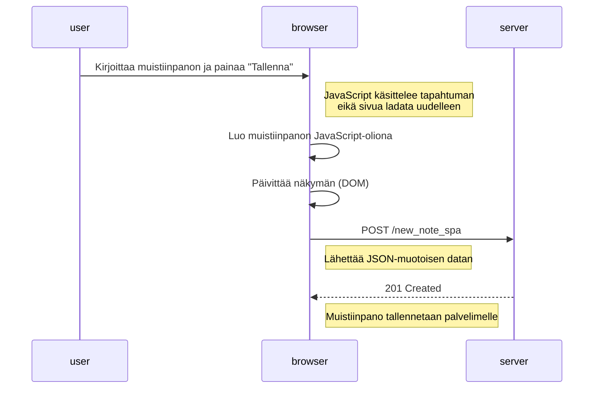

```mermaid
sequenceDiagram
    participant user
    participant browser
    participant server

    user->>browser: Kirjoittaa muistiinpanon ja painaa "Tallenna"
    Note right of browser: JavaScript käsittelee tapahtuman<br>eikä sivua ladata uudelleen

    browser->>browser: Luo muistiinpanon JavaScript-oliona
    browser->>browser: Päivittää näkymän (DOM)

    browser->>server: POST /new_note_spa
    Note right of browser: Lähettää JSON-muotoisen datan

    server-->>browser: 201 Created
    Note left of server: Muistiinpano tallennetaan palvelimelle
```
